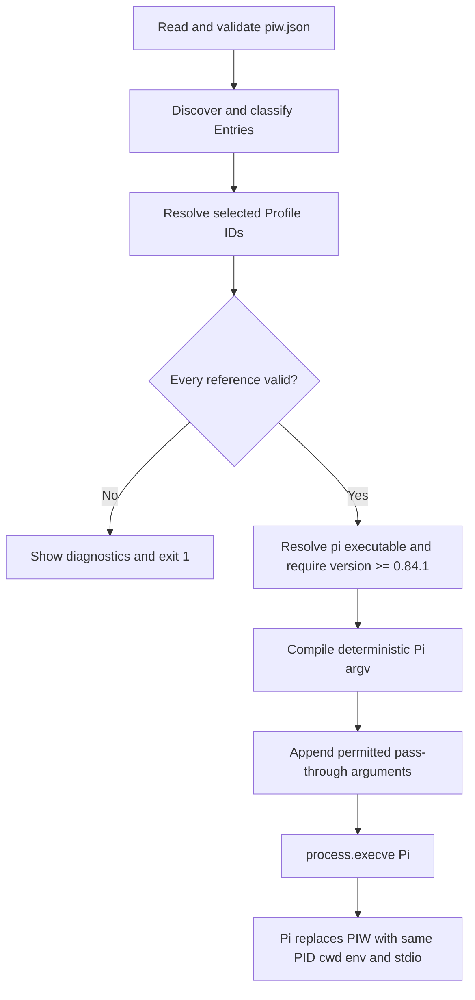
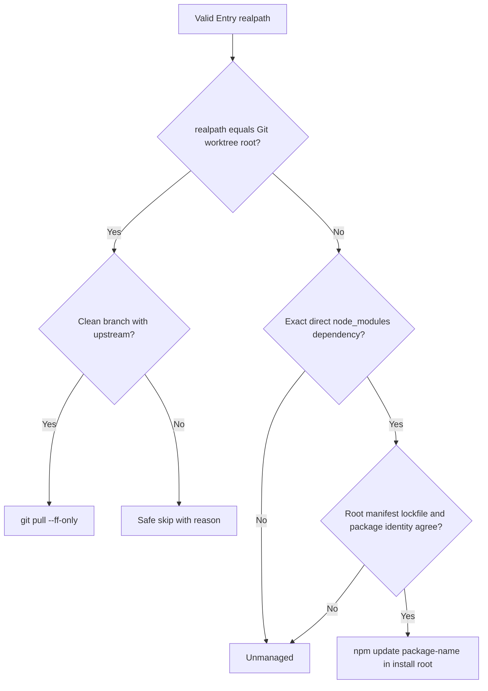
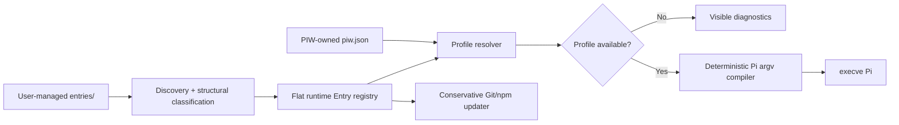

# PIW — Requirements & Product Design

> Status: Approved v0.1 contract
>
> Product name: `piw`
>
> Scope: Lightweight profile registry, configurator, validator, updater, and launcher for Pi
>
> Product-contract authority: This document is the canonical source for PIW product behavior. `release.md` defines distribution and release policy and MUST reference, not redefine, the behavior specified here.

---

## 1. Product Summary

`piw` is a lightweight resource registry and profile launcher for Pi.

It does **not** create or manage an alternative Pi Agent Home. It does **not** own user resources, install missing resources, or act as a package manager.

Instead, PIW:

1. scans a fixed user-managed registry directory for entries;
2. lets the user compose named profiles from those entries;
3. validates profile availability before launch;
4. compiles the selected profile into explicit Pi CLI resource arguments;
5. replaces itself with Pi; and
6. updates an entry only when its external Git or npm manager can be proven conservatively.

Core principle:

> **The filesystem is the source of truth for entries. `piw.json` is the source of truth for PIW-owned profile state.**

---

## 2. Goals and Non-Goals

### 2.1 Goals

PIW v0.1 SHALL:

- provide multiple lightweight Pi profiles without duplicating Pi Agent Homes;
- support extensions, skills, themes, prompt templates, and Pi packages through one `Entry` abstraction;
- keep registered Entry IDs in one flat, globally unique namespace;
- compose profiles as deterministic sets of Entry IDs;
- expose an interactive profile selector and profile configuration TUI;
- keep broken profiles visible while preventing them from launching;
- launch Pi with automatic discovery disabled for the four resource classes PIW manages;
- preserve Pi's normal model, authentication, session, tool, project-trust, and context-file behavior;
- permit non-resource Pi arguments after an explicit `--` separator;
- update Git and npm entries only when their management scope is provable; and
- remain a lightweight Unix-style TypeScript CLI distributed through npm.

### 2.2 Non-Goals

PIW v0.1 SHALL NOT:

- replace or redirect `~/.pi/agent`;
- manage Pi authentication, providers, models, thinking settings, sessions, memory, or `AGENTS.md`;
- select or persist Pi's current theme;
- install missing entries, npm packages, or Pi itself;
- clone Git repositories;
- copy, vendor, move, rename, or normalize Entry content;
- maintain a package lock or dependency graph of its own;
- interpret or filter a Pi package's internal resources;
- execute extension code as part of validation;
- guarantee detection of runtime tool, command, or resource collisions inside extensions or packages;
- support aliases, profile inheritance, profile groups, or project-local profiles;
- provide machine-readable `list` or `doctor` output; or
- update the PIW executable through `piw update`.

---

## 3. Filesystem and Ownership Contract

PIW v0.1 uses exactly this layout:

```text
~/.pi/
├── agent/                  # Owned by Pi; PIW never writes here
└── piw/
    ├── entries/            # Fixed user-managed registry root
    └── piw.json            # PIW's only canonical persistent state file
```

The paths are fixed in v0.1:

```text
Registry root:  ~/.pi/piw/entries/
State file:     ~/.pi/piw/piw.json
```

PIW MAY create `~/.pi/piw/`, `entries/`, and a minimal `piw.json` on first run. It MUST NOT overwrite an existing state file during initialization.

### 3.1 Ownership Boundary

The user or an external manager owns every object registered below `entries/`, including a symlink's target. PIW owns only `piw.json`.

During discovery, configuration, validation, diagnosis, and launch, PIW MUST NOT:

- rewrite Entry files;
- move or rename registry items;
- install Entry dependencies;
- repair an invalid Entry; or
- write hidden metadata beside an Entry.

The sole exception is the explicitly invoked `piw update` operation. After proving an Entry's external manager and management root under Section 12, PIW MAY invoke that manager. The external manager—not PIW—then modifies its own managed content.

### 3.2 Symlinks

An immediate child of `entries/` MAY be a symbolic link to any local target, including a target outside `~/.pi/piw/`.

PIW MUST:

- use the link's registry name as the stable Entry ID;
- resolve the target with `realpath` before validation, launch, or update classification;
- reject broken links, loops, missing targets, and unreadable targets;
- show both registry path and resolved target in `doctor`; and
- use the resolved target—not the link path—to prove Git or npm ownership.

---

## 4. Persistent State Contract

PIW owns exactly one canonical persistent state file:

```text
~/.pi/piw/piw.json
```

The v1 schema is conceptually:

```ts
type ProfileName = string;
type EntryId = string;

interface PiwStateV1 {
  version: 1;
  profiles: Record<ProfileName, {
    entries: EntryId[];
  }>;
}
```

The minimal valid file is:

```json
{
  "version": 1,
  "profiles": {}
}
```

### 4.1 Schema Rules

- The file MUST be UTF-8 JSON; comments are not supported.
- The top level MUST contain exactly `version` and `profiles`.
- A profile value MUST contain exactly `entries`.
- `version` MUST equal `1` for v0.1.
- An unsupported future version MUST fail safely and MUST NOT be rewritten.
- Profile names and Entry IDs MUST satisfy their rules in Sections 6 and 7.
- A profile's Entry IDs MUST be unique and stored in natural ascending order.
- PIW MUST NOT store Entry paths, Entry kinds, discovery caches, updater metadata, or a last-selected profile.
- Unknown fields, invalid JSON, invalid types, duplicate logical names, and invalid identifiers MUST produce actionable errors.

### 4.2 Atomic and Concurrent Writes

All state mutations MUST use an atomic replacement strategy in the state-file directory:

```text
serialize and validate new state
        ↓
write a unique temporary file
        ↓
flush and close
        ↓
atomically rename over piw.json
```

Temporary files are not canonical state.

When `piw config` opens, it MUST retain a fingerprint of the state it loaded. Before saving, it MUST verify that the on-disk file still matches that fingerprint. If an external edit occurred, PIW MUST refuse to overwrite it and instruct the user to reopen the configuration TUI.

---

## 5. Core Entry Model

PIW exposes one user-facing abstraction:

```ts
type EntryKind = "extension" | "skill" | "prompt" | "theme" | "package";

interface Entry {
  id: EntryId;
  kind: EntryKind;
  registryPath: string;
  realPath: string;
  status: "valid" | "invalid";
  diagnostics: string[];
}
```

This is a conceptual runtime model, not persistent state.

A loose resource and a Pi package are both Entries. A package remains one opaque, indivisible Entry even when it contains several extensions, skills, prompts, and themes.

The registry is logically flat:

```text
worktree
superpowers
browser
review
dark-theme
frontend-kit
```

It is not a kind-based hierarchy such as `skills/superpowers` or `packages/frontend-kit`.

---

## 6. Entry Discovery and IDs

PIW scans only the immediate, non-hidden children of:

```text
~/.pi/piw/entries/
```

Nested files belong to their immediate top-level Entry and MUST NOT become additional registry Entries.

### 6.1 Entry ID Format

Entry IDs MUST match:

```regex
^[a-z0-9][a-z0-9_-]{0,63}$
```

Rules:

- IDs contain only lowercase ASCII letters, digits, `-`, and `_`.
- IDs are 1–64 characters.
- Directory and symlink IDs are their immediate registry item names.
- A supported standalone file removes exactly one supported extension: `review.md` becomes `review`.
- Hidden registry items are ignored.
- IDs share one global namespace across all kinds.
- Uniqueness MUST be checked case-insensitively even on a case-sensitive filesystem.
- An invalid registry name is an invalid candidate and MUST be reported by `doctor`.

For example, these candidates conflict:

```text
browser.ts
browser/
Browser.js
```

No conflicted candidate is usable until the user resolves the registry names.

### 6.2 File Classification

Supported standalone files classify as follows:

| File form | Kind | Minimum validation |
|---|---|---|
| `*.ts`, `*.js` | `extension` | Existing readable regular file |
| `*.md` | `prompt` | Existing readable UTF-8 Markdown file |
| `*.json` | `theme` | Parseable JSON satisfying the theme rules below |

Other standalone extensions are invalid.

### 6.3 Directory Classification

Directories use strong signals first:

1. An effective Pi package signal classifies the directory as `package`:
   - a valid `package.json` containing a `pi` manifest; or
   - one or more Pi convention directories named `extensions/`, `skills/`, `prompts/`, or `themes/`.
2. Otherwise, a root `SKILL.md` classifies it as `skill`.
3. Otherwise, a root `index.ts` or `index.js` classifies it as `extension`.
4. Otherwise, the directory is invalid.

A package MUST resolve, through its manifest or convention directories, to at least one supported resource. Missing manifest targets, paths that escape the package root, or invalid declared structures invalidate the package.

If there is no package signal and incompatible weak signals coexist—for example both root `SKILL.md` and root `index.ts`—PIW MUST mark the Entry invalid rather than guess.

For a `skill`, `SKILL.md` MUST be readable UTF-8 Markdown with YAML frontmatter containing non-empty `name` and `description` strings. A missing description makes the Entry invalid because Pi will not load it. Other Agent Skills conformance issues that Pi treats as warnings—such as a non-standard name—remain warnings rather than making the Entry unavailable.

For a `theme`, the JSON MUST contain a non-empty string `name` without `/`, an optional object `vars`, and an object `colors`. `colors` MUST contain every color token required by Pi 0.84.1's public theme schema. `scrollbarThumb` and `thinkingMax` are optional because Pi defines fallbacks for them. Every supplied color value and variable reference MUST satisfy that schema. PIW SHOULD keep the token list in one versioned validation constant so the compatibility tests in `release.md` can detect upstream schema drift.

### 6.4 Validation Boundary

PIW performs only structural validation needed to produce a safe launch argument.

PIW MUST NOT:

- execute an extension during validation;
- reproduce Pi's full package loader;
- deeply analyze extension source; or
- promise to detect every internal command, tool, theme, prompt, or skill collision.

PIW MAY emit warnings for collisions visible through static metadata. Pi remains the final authority on runtime loading and internal resource collisions.

---

## 7. Profile Contract

A profile is a named set of Entry IDs:

```ts
interface Profile {
  name: string;
  entries: EntryId[];
}
```

Example:

```json
{
  "name": "builder",
  "entries": [
    "browser",
    "dark-theme",
    "review",
    "superpowers",
    "worktree"
  ]
}
```

### 7.1 Profile Names

Profile names use the same format as Entry IDs:

```regex
^[a-z0-9][a-z0-9_-]{0,63}$
```

They MUST be globally unique and MUST NOT equal a reserved CLI word. The complete v0.1 reserved-name set is:

```text
config
update
list
doctor
help
version
```

### 7.2 Membership and Ordering

- Profiles reference Entries only by ID.
- Profiles MUST NOT contain Entry paths or Entry definitions.
- An Entry ID appears at most once in a profile.
- Membership is a set; user-controlled ordering has no semantic meaning.
- PIW stores, displays, validates, and compiles membership by the deterministic ASCII natural order defined below.
- An empty profile is valid. It represents a clean resource mode with all four managed discovery classes disabled and no registered Entry explicitly loaded.
- A package can be selected only as a whole in v0.1.

### 7.3 Availability

A profile is structurally available only when every referenced Entry exists, has a unique valid ID, resolves successfully, and passes kind-specific structural validation.

A profile with missing or invalid Entries MUST:

- remain visible;
- appear unavailable;
- expose the reasons;
- reject launch; and
- retain its invalid references until the user removes them or the Entries become valid again.

Structural availability is not a trust guarantee and does not guarantee that extension initialization will succeed inside Pi.

### 7.4 Deterministic Natural Order

Whenever this document requires natural ascending order, PIW compares ASCII identifiers as follows:

1. split each identifier into maximal digit and non-digit runs;
2. compare digit runs as base-10 integers;
3. compare non-digit runs by Unicode code point, which is ASCII order for the permitted identifier alphabet;
4. if corresponding runs are equal, the identifier with fewer remaining runs sorts first; and
5. use the complete identifier's code-point order as the final tie-breaker.

For example:

```text
profile-2
profile-10
profile_a
```

### 7.5 Theme Semantics

A selected theme Entry makes that theme resource available to Pi for the run. It does not select the current theme.

PIW MUST NOT write Pi's settings or add an `activeTheme` field to a profile. Theme selection remains Pi's responsibility.

---

## 8. Required CLI Surface

PIW v0.1 MUST provide:

```text
piw
piw -- <pi-args...>
piw <profile>
piw <profile> -- <pi-args...>
piw config
piw update
piw list
piw doctor
piw --help
piw --version
```

### 8.1 Command Behavior

| Command | Required behavior |
|---|---|
| `piw` | Validate profiles, open selector, and exec Pi after selection |
| `piw -- <pi-args...>` | Open selector, then launch with allowed Pi arguments |
| `piw <profile>` | Validate and directly launch the named profile |
| `piw <profile> -- <pi-args...>` | Directly launch and append allowed Pi arguments |
| `piw config` | Open profile configuration TUI |
| `piw update` | Immediately update conservatively proven Git/npm Entries |
| `piw list` | Print human-readable Entries and profiles without mutation |
| `piw doctor` | Print read-only diagnostics without launching Pi |
| `piw --help` | Print PIW usage |
| `piw --version` | Print PIW version |

`piw list` output MUST be deterministically ordered and show Entry ID, kind, status, and registry path, followed by each profile's sorted membership and availability.

`piw doctor` MUST check at least:

- state existence, JSON validity, and schema version;
- registry-name validity and collisions;
- symlink resolution;
- Entry classification and structural validity;
- profile references and availability;
- `pi` presence and compatible version; and
- `git`/`npm` presence and updater classification where relevant.

### 8.2 Exit Codes

| Exit code | Meaning |
|---|---|
| `0` | Command completed successfully, or `doctor` found warnings only |
| `1` | State, discovery, profile, compatibility, launch, or attempted update failure |
| `2` | CLI usage or argument error |

For `piw update`, unmanaged Entries and conservative safety skips are not attempted-update failures. A nonzero manager command is a failure. The command exits `1` if at least one attempted update fails, while continuing all unrelated updates.

### 8.3 TTY Requirements

`piw` selector and `piw config` require an interactive terminal. In a non-TTY context PIW MUST fail with guidance to use `piw <profile>` for direct launch or a read-only command for inspection.

---

## 9. Profile Selector TUI

Running `piw` with no profile opens an explicit selector:

```text
Select Pi Profile

> builder          ready
  minimal          ready
  researcher       unavailable
  reviewer         ready
```

Required interaction:

- Up/Down move the highlight.
- Enter launches the highlighted profile only when available.
- Escape or `q` exits without launching.
- Profiles sort by natural ascending name.
- The initial highlight is the first available profile.
- If none are available, the first row may be highlighted for diagnosis, but Enter MUST NOT launch it.
- The UI MUST show missing/invalid Entry reasons for the highlighted unavailable profile.

If no profiles exist, `piw` initializes missing PIW-owned state as needed, prints:

```text
No profiles are configured. Run `piw config` to create one.
```

and exits `1`. PIW MUST NOT create a default profile automatically.

---

## 10. Profile Configuration TUI

`piw config` opens a profile list and supports:

- create;
- inspect;
- rename;
- delete with explicit confirmation; and
- add/remove Entries through multi-select.

Profile detail example:

```text
builder

[x] browser             extension
[x] dark-theme          theme
[!] old-review          missing: referenced by profile
[ ] research            skill
[x] superpowers         package

Space toggle  S save  Esc back
```

Rules:

- Valid Entries can be toggled with Space.
- Invalid discovered candidates remain visible with their reason but cannot be newly selected.
- Missing or invalid IDs already referenced by the profile remain visible and can be removed deliberately.
- Changes are staged in memory.
- `s` explicitly validates and saves all staged changes atomically.
- Exiting with unsaved changes prompts: save, discard, or continue editing.
- A deletion requires a second confirmation.
- A save MUST reject invalid profile names, reserved names, duplicates, invalid Entry IDs, and concurrent external state changes.
- Configuration changes update only `piw.json`; they never modify Entries.

---

## 11. Launch Contract

The launch path is:



### 11.1 Resource Isolation

Every profile launch MUST begin Pi's resource arguments with:

```text
--no-extensions
--no-skills
--no-prompt-templates
--no-themes
```

This disables automatic discovery only for the four resource classes PIW manages. PIW MUST NOT add `--no-context-files` and MUST NOT alter Pi's model, authentication, session, provider, built-in tool, or project-trust behavior.

### 11.2 Entry Argument Compilation

After the four isolation flags, PIW processes Entries by natural ascending ID:

| Entry kind | Pi arguments |
|---|---|
| `extension` | `-e <absolute-real-path>` |
| `skill` | `--skill <absolute-real-path>` |
| `prompt` | `--prompt-template <absolute-real-path>` |
| `theme` | `--theme <absolute-real-path>` |
| `package` | `-e <absolute-package-root>` |

Pi itself expands an explicitly supplied local package root using its package manifest or conventional directories. PIW MUST NOT expand or filter the package.

### 11.3 Pi Argument Pass-Through

Only arguments after an explicit `--` are passed to Pi. They are appended after PIW's generated resource arguments.

PIW MUST reject any pass-through resource option, including separated, short, and `--option=value` forms:

```text
-e
--extension
--skill
--prompt-template
--theme
--no-extensions
-ne
--no-skills
-ns
--no-prompt-templates
-np
--no-themes
```

All other Pi arguments and initial messages are passed as an exact argument array without shell parsing. This permits options such as model, provider, session, tools, trust, and offline mode while preserving the profile as the sole resource-set authority.

### 11.4 Process Replacement

PIW MUST resolve `pi` through `PATH`, obtain its absolute executable path, and verify `pi --version` is at least `0.84.1` before launch.

PIW then MUST call Node's `process.execve()` with:

- the absolute Pi executable path;
- an argument vector whose first element is the program name `pi`, followed by the compiled arguments;
- the current environment; and
- inherited current working directory and standard file descriptors.

Conceptually:

```ts
const argv = ["pi", ...generatedResourceArgs, ...permittedPassthroughArgs];
process.execve(piAbsolutePath, argv, process.env);
```

PIW MUST NOT invoke a shell and MUST NOT remain as a supervisor process. Successful replacement preserves the PID and gives Pi direct ownership of signals and final exit status.

If the path is not executable or `execve` returns an error, PIW MUST print an actionable error and exit `1`. It MUST NOT silently fall back to `spawn`.

---

## 12. Entry Update Contract

`piw update` is an explicit user-authorized mutation of externally managed Entry content. It starts immediately without a preview confirmation or `--yes` requirement.

PIW first scans and classifies all valid Entries, then performs updates sequentially. Detection is mutually exclusive:



One Entry receives at most one update strategy per run. A false negative is acceptable; a false positive is not.

### 12.1 Git-Managed Entries

An Entry is Git-managed only when its resolved real path is exactly the Git worktree root.

An Entry that points to a subdirectory of a larger repository is not Git-managed by PIW because updating it would mutate content beyond the registered Entry boundary.

Before updating, PIW MUST establish all of the following:

- `git` is available;
- the real path is a worktree root;
- the worktree is clean, including tracked and untracked changes;
- HEAD is attached to a branch; and
- the branch has an upstream.

The only update command is equivalent to this argument-array invocation:

```text
git -C <worktree-root> pull --ff-only
```

PIW MUST NOT merge, rebase, stash, reset, clean, discard modifications, change branches, or create commits.

Dirty state, detached HEAD, missing upstream, or missing Git causes a safe skip with an explicit reason. A pull that was attempted and returned nonzero is a failure.

Before a pull, PIW records the worktree's HEAD commit. After a successful pull it reads HEAD again. A changed commit is `updated`; an unchanged commit is `up-to-date`. If HEAD cannot be read after the command, the attempted update is `failed` even when Git returned zero.

If multiple registered symlinks resolve to the same Git root, PIW updates that real root once and maps the shared result to every associated Entry.

### 12.2 npm-Managed Entries

The existence of `package.json` alone never proves npm management.

PIW v0.1 recognizes only a top-level direct dependency installed in one of these exact forms:

```text
<install-root>/node_modules/<name>
<install-root>/node_modules/@scope/<name>
```

All of the following evidence is required:

1. `<install-root>/package.json` exists and parses.
2. `<install-root>/package-lock.json` exists, parses, and uses lockfile v2 or v3 with a `packages` map.
3. The package key appears in root `dependencies`, `devDependencies`, or `optionalDependencies`.
4. The Entry's own `package.json#name` equals the dependency key and node_modules path.
5. `package-lock.json` contains the matching `packages["node_modules/<name>"]` record; its non-empty `version` equals the installed package's `package.json#version`, and its `link` field is not `true`.
6. The Entry registry item and installed package directory resolve to the same real path, and that installed package directory is not itself a symbolic link. This excludes npm workspaces and linked packages.

The following are unmanaged in v0.1:

- transitive or nested dependencies;
- npm aliases;
- workspace symlinks;
- package-lock v1 or lockfiles without a verifiable `packages` record;
- Entries merely containing a `package.json`; and
- any layout whose install root or package identity is ambiguous.

The only npm update is equivalent to:

```text
cwd: <install-root>
command: npm
args: ["update", "<package-name>"]
```

PIW MUST use an argument array, never shell interpolation. Missing npm causes a safe skip. A command that is attempted and returns nonzero is a failure.

Duplicate `(installRoot, packageName)` pairs update once. Different direct dependencies sharing an install root update sequentially by Entry ID.

Before an attempted npm update, PIW records the installed package's `package.json#version` and its matching lockfile package record. After a successful command it reads them again. If either value changed, the outcome is `updated`; if both are unchanged, the outcome is `up-to-date`. If the post-update evidence can no longer be read or validated, the attempted update is `failed` even when npm returned zero.

### 12.3 Output and Failure Isolation

Each Entry receives one of:

```text
updated
up-to-date
skipped: <reason>
unmanaged
failed: <reason>
```

Example:

```text
Updating PIW entries

✓ browser-tools   npm    updated
- dark-theme      local  unmanaged
! superpowers     git    skipped: dirty working tree
✓ worktree        git    up-to-date

Updated:     1
Up-to-date:  1
Skipped:     1
Unmanaged:   1
Failed:      0
```

One failure MUST NOT abort unrelated updates. Summary counts MUST exactly match the per-Entry outcomes.

PIW stores no manager metadata. It recomputes all ownership evidence from the real filesystem on every run.

---

## 13. Error and Diagnostic Contract

PIW MUST fail visibly and conservatively.

Representative messages:

```text
Profile "builder" cannot start.

Missing entries:
  - browser
```

```text
Entry "foo" could not be classified safely.
Found both SKILL.md and index.ts without a Pi package signal.
```

```text
PIW state version 3 is newer than this release supports.
Upgrade PIW before modifying this state file.
```

```text
PIW cannot launch because `pi` was not found on PATH.
Install Pi separately and retry.
```

```text
PIW requires Pi >=0.84.1; found 0.83.0.
```

```text
superpowers: update skipped
Reason: Git working tree contains local changes.
```

Diagnostics MUST identify the affected profile or Entry and state what the user can do next. Ambiguity causes invalidation or a skip, never a guessed mutation.

---

## 14. Security Model

Pi extensions execute with the user's permissions, and skills may instruct a model to perform arbitrary actions. PIW is not a sandbox or trust verifier.

PIW MUST:

- show the resolved Entry set before launch where practical;
- never silently download or install missing resources;
- never execute Entry code during validation;
- never execute updater logic without strict manager proof;
- avoid shell interpolation for Pi, Git, and npm commands;
- treat profile validation as structural availability, not trust verification; and
- preserve Pi's own project-trust behavior.

The user remains responsible for trusting registered resources.

---

## 15. Product Invariants

The following are fixed PIW v0.1 invariants:

1. One unified user-facing `Entry` abstraction.
2. One flat, case-insensitively unique Entry ID namespace.
3. Fixed Entry root: `~/.pi/piw/entries/`.
4. One canonical PIW state file: `~/.pi/piw/piw.json`.
5. Profiles contain only deterministic sets of Entry IDs.
6. The filesystem is the source of truth for Entry content and structure.
7. PIW owns no Entry content and installs no missing resources.
8. PIW never creates an alternative Pi Agent Home.
9. A broken profile remains visible but cannot launch.
10. An empty profile is valid and disables all four managed discovery classes.
11. Package internals are opaque and an entire package is one Entry.
12. Profiles control theme availability, not active-theme selection.
13. Launch compiles explicit resource arguments and rejects pass-through resource overrides.
14. PIW replaces itself with Pi through `process.execve()`.
15. Updater detection is automatic, mutually exclusive, conservative, and stateless.
16. Git updates apply only when the Entry real path is the repository root.
17. npm updates apply only to lockfile-proven top-level direct dependencies.
18. Ambiguity causes invalidation or skip, never guessing.
19. `piw update` updates Entries, never PIW itself.
20. Pi remains the final authority on runtime package and extension semantics.

---

## 16. Acceptance Scenarios

An implementation is conformant only if it satisfies at least these scenarios:

1. First run creates missing PIW-owned paths and minimal state without overwriting existing files.
2. With no profiles, `piw` directs the user to `piw config` and returns `1`.
3. An empty profile launches with the four isolation flags and no Entry arguments.
4. The selector sorts profiles, supports Up/Down and Enter, and refuses unavailable profiles.
5. `piw builder -- --model provider/model "hello"` preserves the permitted Pi argument array.
6. Pass-through `-e`, `--skill`, `--theme`, or another managed resource option is rejected with exit `2`.
7. Every loose Entry kind compiles to its specified Pi flag.
8. A package compiles to one `-e <root>` and PIW does not expand its contents.
9. A theme Entry becomes available without PIW modifying Pi's active theme.
10. A symlink uses its registry name as ID and may target a path outside the PIW root.
11. A broken symlink is invalid and makes referencing profiles unavailable.
12. Case-insensitive Entry ID collisions invalidate the candidates on macOS and Linux.
13. Missing and invalid references remain in state until deliberately removed.
14. An external edit during `piw config` prevents overwrite on save.
15. Two Entry links to one Git root cause one pull operation.
16. Git subdirectories, dirty repositories, detached HEADs, and branches without upstream are skipped.
17. A normal Git project containing `package.json` is not mistaken for an npm-installed Entry.
18. Only a direct lockfile-proven node_modules dependency receives `npm update <name>`.
19. npm aliases, workspace links, transitive dependencies, and unverifiable lockfiles are unmanaged.
20. One attempted update failure does not stop other Entries, and output counts remain exact.
21. A missing or old Pi executable blocks launch with an actionable error.
22. Successful launch replaces PIW with Pi instead of retaining a supervisor.
23. A package-internal runtime collision may be reported by Pi without violating PIW's structural validation contract.

---

## 17. Architecture Summary



---

## 18. Deferred Beyond v0.1

The following are explicitly deferred and MUST NOT be inferred as v0.1 requirements:

- Entry aliases or manual kind overrides;
- configurable or multiple registry roots;
- project-local profiles;
- profile inheritance or groups;
- profile-controlled model or thinking settings;
- profile-controlled active theme selection;
- package resource filtering;
- switching profiles inside a running Pi session;
- machine-readable JSON output;
- npm alias, workspace, or transitive dependency updates;
- integration with Pi's package update command;
- a PIW self-updater; and
- Windows support.

---

## 19. Pi Compatibility Basis

PIW v0.1 requires Pi `>=0.84.1` and relies on these Pi behaviors:

- `-e` / `--extension` explicitly loads an extension file or local package directory;
- an explicit local package directory is expanded using Pi package rules;
- `--skill`, `--prompt-template`, and `--theme` load explicit resources;
- `--no-extensions`, `--no-skills`, `--no-prompt-templates`, and `--no-themes` disable automatic discovery while retaining explicit CLI resources;
- Pi packages may expose extensions, skills, prompts, and themes through a manifest or conventional directories; and
- `--theme` loads a theme resource but does not select the active theme.

Release verification MUST test these assumptions against Pi `0.84.1` and the latest stable Pi version before publication.

Official references:

- https://pi.dev/docs/latest/packages
- https://pi.dev/docs/latest/extensions
- https://pi.dev/docs/latest/skills
- https://pi.dev/docs/latest/prompt-templates
- https://pi.dev/docs/latest/themes
- https://pi.dev/docs/latest/usage
