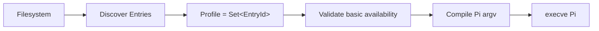
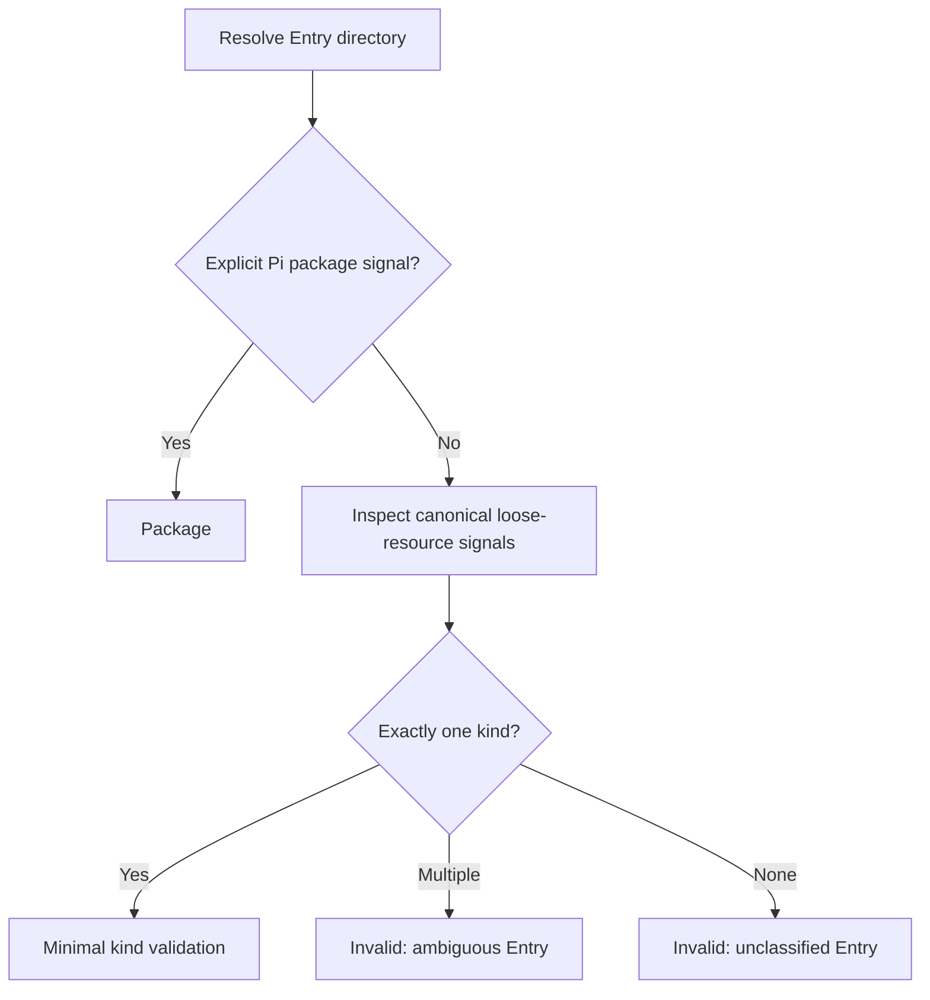
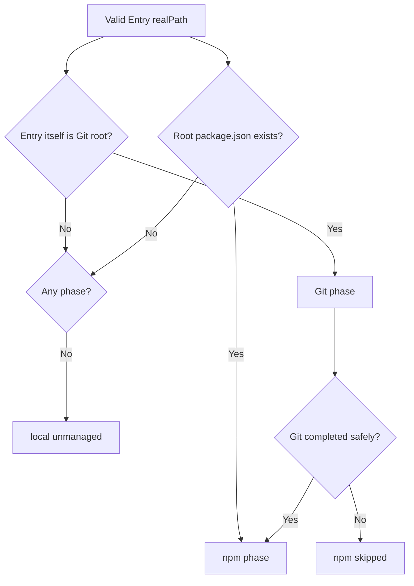

# PIW — Requirements & Product Design

> Status: Approved v0.1 contract
>
> Product name: `piw`
>
> Scope: Lightweight filesystem-native profile launcher for Pi
>
> Product-contract authority: This document is the canonical source for PIW product behavior. `release.md` defines distribution and release policy only.

---

## 1. Product Summary

PIW is a deliberately small profile launcher for Pi:



The filesystem is the source of truth for Entries. `~/.pi/piw/piw.json` is the only PIW-owned persistent file. PIW validates only enough to decide how an Entry must be represented on Pi's command line. Pi remains the final authority on resource semantics.

PIW is not another Pi Agent Home, package manager, resource installer, dependency resolver, package provenance system, replacement resource validator, daemon, or supervisor.

## 2. Goals and Non-Goals

PIW v0.1 SHALL:

- provide named profiles without duplicating Pi Agent Homes;
- expose extensions, skills, prompt templates, themes, and Pi packages through one flat Entry abstraction;
- derive every Entry from a user-managed top-level directory below `~/.pi/piw/`;
- keep profiles as deterministic sets of Entry IDs;
- keep broken profiles visible while preventing them from launching;
- disable Pi's automatic discovery for PIW-managed resource classes and explicitly load the selected resources;
- preserve Pi's normal model, authentication, session, tool, project-trust, context-file, environment, working-directory, and stdio behavior;
- support conservative Entry-local Git and npm updates when explicitly invoked; and
- replace itself with Pi through `process.execve()`.

PIW v0.1 SHALL NOT:

- replace or redirect `~/.pi/agent`;
- install, copy, move, rename, delete, repair, normalize, or vendor Entry content;
- maintain Entry metadata, source metadata, dependency graphs, manager metadata, caches, or last-update state;
- clone Git repositories or install missing Entries;
- interpret, expand, validate, or filter the internal resources of a Pi package;
- execute or import extension code during validation;
- duplicate Pi's complete skill, prompt, theme, extension, or package validators;
- select or persist an active theme;
- provide profile inheritance, aliases, groups, project-local profiles, or machine-readable output;
- supervise Pi after launch; or
- update the PIW executable through `piw update`.

## 3. Filesystem and Ownership Contract

PIW v0.1 uses one flat root:

```text
~/.pi/piw/
├── piw.json                  # the only PIW-owned persistent file
├── worktree/                 # Entry ID: worktree
│   └── index.ts
├── superpowers/              # Entry ID: superpowers
│   ├── SKILL.md
│   └── references/
├── review/                   # Entry ID: review
│   └── review.md
├── tokyo-night/              # Entry ID: tokyo-night
│   └── tokyo-night.json
└── frontend-kit/             # Entry ID: frontend-kit
    ├── package.json
    ├── extensions/
    ├── skills/
    ├── prompts/
    └── themes/
```

Fixed paths:

```text
PIW home and Entry root: ~/.pi/piw/
State file:              ~/.pi/piw/piw.json
```

There is no intermediate registry layer between the PIW root and its Entries, and no kind-based hierarchy such as `extensions/`, `skills/`, or `packages/` at registry level.

On first mutating use PIW MAY create `~/.pi/piw/` and a minimal `piw.json`. It MUST NOT create any Entry directory. `piw list` and `piw doctor` are read-only and MUST NOT initialize missing paths or state.

Everything other than `piw.json` under the root is user-managed. Except for an explicitly requested `piw update`, PIW MUST NOT write Entry content. PIW never writes hidden metadata beside Entries.

### 3.1 Directory-Only Entries

Every non-hidden top-level directory is an Entry candidate. Entry ID is its basename. Nested objects remain opaque content of that Entry and never become separate Entries.

A top-level symbolic link is allowed when it resolves to a directory. PIW MUST:

- use the symlink basename as the Entry ID;
- retain the symlink path as `registryPath`;
- use the resolved absolute target as `realPath` for validation, launch, and update detection;
- reject broken links, loops, unreadable targets, and links to files; and
- never mutate or replace the symlink itself.

The reserved `piw.json` file and every name beginning with `.` are ignored by discovery. Any other top-level regular file or unsupported object is not an Entry and is reported by `doctor` as an unsupported root item. Loose resources such as `browser.ts`, `review.md`, and `theme.json` are not supported.

The unreleased historical `/entries` layout receives no migration, dual scanning, fallback, or compatibility flag. A top-level directory literally named `entries` is evaluated only as an ordinary Entry candidate.

## 4. Persistent State Contract

The v1 state schema remains:

```ts
interface PiwStateV1 {
  version: 1;
  profiles: Record<string, {
    entries: string[];
  }>;
}
```

Minimal state:

```json
{
  "version": 1,
  "profiles": {}
}
```

Rules:

- State is UTF-8 JSON with exactly `version` and `profiles` at top level.
- A profile has exactly one `entries` array.
- `version` is exactly `1`; future versions fail safely and are never rewritten.
- Profile names and Entry IDs match `^[a-z0-9][a-z0-9_-]{0,63}$`.
- Reserved profile names are `config`, `update`, `list`, `doctor`, `help`, and `version`.
- Profile Entry IDs are unique and normalized into deterministic natural order.
- State MUST NOT store Entry paths, kinds, launch paths, source or updater metadata, timestamps, caches, or active theme.

State writes validate and serialize the new value, write and flush a unique temporary file beside `piw.json`, compare the current file fingerprint with the one loaded by the configuration UI, then atomically rename. This is atomic replacement with optimistic stale-write detection, not a database, daemon, mutex, or distributed locking system.

## 5. Runtime Entry Model

```ts
type EntryKind = "extension" | "skill" | "prompt" | "theme" | "package";

interface EntryBase {
  id: string;
  registryPath: string;
  realPath: string;
  diagnostics: Diagnostic[];
}

interface ValidEntry extends EntryBase {
  status: "valid";
  kind: EntryKind;
  launchPath: string;
}

interface InvalidEntry extends EntryBase {
  status: "invalid";
  kind?: EntryKind;
  launchPath?: string;
}

type Entry = ValidEntry | InvalidEntry;
```

This model is reconstructed from the live filesystem and never persisted. A package is one opaque Entry even when it contains many Pi resources.

Entry IDs share one flat namespace, are checked case-insensitively for collisions, and use the directory or symlink basename without transformation. Every colliding candidate is invalid.

## 6. Discovery and Classification

PIW resolves each candidate to a directory and applies this precedence:



### 6.1 Package Entry

Canonical form:

```text
frontend-kit/
├── package.json
├── extensions/
├── skills/
├── prompts/
└── themes/
```

A package signal is either:

- a parseable `package.json` whose `pi` value is a non-null, non-array object; or
- at least one actual directory named `extensions`, `skills`, `prompts`, or `themes`.

Package signal has precedence over all loose-resource signals. `package.json` alone is not a package signal because an ordinary extension or other Entry may use npm dependencies.

Once a package signal exists, PIW classifies the directory as `package` and stops. It MUST NOT expand manifest arrays, evaluate globs or exclusions, resolve targets, check target existence, inspect internal resources, or reproduce Pi's package loader. Convention directories need not be non-empty. Pi is the only authority on package semantics.

Launch target:

```text
-e <absolute-entry-realpath>
```

### 6.2 Extension Entry

Canonical form:

```text
worktree/
├── index.ts                 # or index.js, not both
├── package.json             # optional dependency metadata
├── node_modules/            # optional
└── arbitrary supporting files
```

Minimal validation requires exactly one readable regular root file named `index.ts` or `index.js`. PIW does not execute or import it. `package.json` does not change the kind unless it contains a Pi package manifest.

Launch target:

```text
-e <absolute-entry-realpath>/index.ts
```

or `index.js`. PIW MUST NOT pass the directory, because Pi interprets a local directory using package rules.

### 6.3 Skill Entry

Canonical form:

```text
superpowers/
├── SKILL.md
├── references/
├── scripts/
├── assets/
└── arbitrary supporting files
```

Minimal validation requires a readable UTF-8 regular root `SKILL.md` with YAML frontmatter containing non-empty string `name` and `description`. Unknown or optional metadata is ignored. Supporting files remain opaque and in place so relative references keep working. PIW does not implement the complete Agent Skills validator.

Launch target:

```text
--skill <absolute-entry-realpath>
```

### 6.4 Prompt Template Entry

Canonical form:

```text
review/
└── review.md
```

The required filename is `<entry-id>.md`, preserving the Pi command-name relationship. Minimal validation requires a readable UTF-8 regular Markdown file. Optional frontmatter and prompt syntax remain Pi's concern.

Launch target:

```text
--prompt-template <absolute-entry-realpath>/<entry-id>.md
```

### 6.5 Theme Entry

Canonical form:

```text
tokyo-night/
└── tokyo-night.json
```

The required filename is `<entry-id>.json`. Minimal validation requires parseable UTF-8 JSON with an object at top level, a non-empty string `name`, and an object `colors`. PIW does not maintain Pi's token table, validate every color value, or validate variable references.

Launch target:

```text
--theme <absolute-entry-realpath>/<entry-id>.json
```

Selecting a theme Entry makes it available; it does not activate it. PIW never modifies Pi settings or adds active-theme profile state.

### 6.6 Ambiguity and UTF-8

Without a package signal, the loose-resource signals are `SKILL.md`, `index.ts`/`index.js`, `<id>.md`, and `<id>.json`. Multiple different kinds are invalid. Both `index.ts` and `index.js` are also invalid. No recognizable signal is invalid.

Text validation uses fatal UTF-8 decoding. PIW asks only whether it can confidently determine the CLI representation; deeper legality remains Pi's responsibility.

## 7. Profiles and TUI

A profile is only a named set of Entry IDs. Membership has no user-controlled ordering and is normalized using deterministic ASCII natural order. Empty profiles are valid and represent a clean Pi resource mode.

A profile is available only when every referenced ID resolves to a valid Entry. Missing and invalid references:

- remain visible in the selector and configuration UI;
- make the profile unavailable;
- expose diagnostics;
- prevent launch; and
- remain stored until deliberately removed or made valid again.

The profile selector preserves natural ordering, Up/Down navigation, Enter for an available profile, and `q`/Escape cancellation. Unavailable profiles are dimmed and explain their diagnostics.

The configuration TUI preserves profile create, rename, confirmed delete, and Entry membership multi-select. It writes only `piw.json`. Invalid Entries cannot be newly selected; previously referenced missing or invalid IDs remain visible and removable.

## 8. CLI and Launch Contract

Required commands:

```text
piw
piw -- <pi-args...>
piw <profile>
piw <profile> -- <pi-args...>
piw config
piw update
piw list
piw doctor
piw --help
piw --version
```

Interactive selector and configuration commands require a TTY. `list` and `doctor` are read-only. Exit `0` means success or doctor warnings only, exit `1` means operational/validation/update failure, and exit `2` means CLI usage error.

Every profile launch starts with:

```text
--no-extensions
--no-skills
--no-prompt-templates
--no-themes
```

Then valid Entries are emitted in natural ID order:

| Kind | Pi arguments |
|---|---|
| extension | `-e <entry>/index.ts\|index.js` |
| skill | `--skill <entry-directory>` |
| prompt | `--prompt-template <entry>/<id>.md` |
| theme | `--theme <entry>/<id>.json` |
| package | `-e <entry-directory>` |

Arguments after an explicit `--` are appended exactly without shell parsing, except PIW rejects all resource-set overrides:

```text
-e
--extension
--skill
--prompt-template
--theme
--no-extensions
-ne
--no-skills
-ns
--no-prompt-templates
-np
--no-themes
```

PIW resolves `pi` from `PATH`, executes `pi --version`, and requires at least `0.84.1`. It then calls `process.execve()` with the absolute Pi executable, `['pi', ...compiledArgs]`, and the current environment. PIW does not use a shell, change cwd, replace stdio, spawn a supervisor, or fall back to supervision.

## 9. Entry Update Contract

`piw update` is an explicit user-authorized mutation of valid Entry directories. Detection is recomputed from the current filesystem and stored nowhere.

An Entry has zero, one, or two ordered phases:



### 9.1 Git Detection and Update

With Git available, PIW runs `git -C <entry> rev-parse --show-toplevel` and requires the resolved result to equal Entry `realPath`. This supports normal repositories and linked worktrees whose `.git` is a file. A subdirectory of a larger repository is not Git-managed by PIW.

When Git is unavailable but a root `.git` file or directory exists, PIW still reports a Git phase as skipped because Git is missing.

Before mutation PIW requires a clean worktree, attached HEAD, and upstream. Dirty state, detached HEAD, missing upstream, or missing Git is a safe skip. The only mutation is:

```text
git -C <entry-realpath> pull --ff-only
```

PIW never stashes, resets, cleans, checks out, merges, rebases, or forces. HEAD before/after determines `updated` versus `up-to-date`. Inspection errors and nonzero pull results are failures.

### 9.2 npm Detection and Update

A root regular `package.json` is the complete npm signal. PIW does not prove install provenance, inspect node_modules, locate a parent install root, parse package identity, or require a lockfile.

Immediately before npm mutation PIW rechecks that root `package.json` still exists as a regular file. The command is:

```text
cwd: <entry-realpath>
command: npm
args: ["update", "--json"]
```

Successful JSON `added`, `removed`, and `changed` counts distinguish `updated` from `up-to-date`. A successful command with unparseable output is conservatively reported as `updated`. Missing npm is a safe skip; a nonzero command is a failure.

### 9.3 Combined Phases and Isolation

Git and npm may both apply to one Entry. Git always runs first. npm runs only after Git reports `updated` or `up-to-date`. A skipped or failed Git phase causes the npm phase to be skipped with `git phase did not complete safely`.

Different Entries remain failure-isolated and execute in deterministic order. Multiple Entry aliases resolving to the same real path reuse the same phase result, so a shared Git root or npm root mutates once per run.

Output groups results per Entry and can show:

```text
worktree
  git   updated
  npm   up-to-date

superpowers
  git   skipped: dirty working tree
  npm   skipped: git phase did not complete safely

review
  local unmanaged
```

Unmanaged and safe skips do not make `piw update` fail. Any attempted manager failure makes the command exit `1` after unrelated Entries have still been processed.

## 10. Doctor Contract

`piw doctor` is a lightweight, read-only inspection that does not require a successful normal snapshot before it can report problems. It checks at least:

- PIW home and `piw.json` existence/type;
- UTF-8 JSON validity and supported schema version;
- unsupported root items;
- Entry ID validity and case-insensitive collisions;
- symlink resolution to a directory;
- classification and minimal resource structure;
- profile references and availability when state is valid;
- Pi executable presence and minimum version;
- Git and npm command presence; and
- each valid Entry's update phases, displayed as `git`, `npm`, `git+npm`, or `unmanaged`.

Missing or incompatible Pi, invalid state, root violations, invalid Entries, and unavailable profiles are errors. Missing optional Git/npm executables are warnings and do not alone make doctor exit nonzero. Doctor never pulls, updates dependencies, initializes state, writes files, or repairs anything.

## 11. Security and Error Model

Pi extensions execute with the user's permissions, skills can instruct an agent to perform arbitrary actions, and npm/Git update commands can execute manager-defined behavior. PIW is not a sandbox or trust verifier.

PIW uses direct argument arrays without shell interpolation, never downloads missing resources during discovery or launch, never executes Entry code during validation, preserves Pi project-trust behavior, and fails visibly when classification or launch representation is ambiguous.

## 12. Product Invariants

1. `~/.pi/piw/piw.json` is PIW's only canonical persistent file.
2. Every non-hidden top-level directory is an Entry candidate; Entries are never loose files.
3. Entry ID is the top-level directory or symlink basename.
4. Profiles contain only Entry IDs.
5. Entry registry state is reconstructed from the filesystem on every run.
6. Package signal has precedence and package internals remain opaque.
7. Validation stops once PIW can confidently choose the Pi CLI argument.
8. A broken profile remains visible but cannot launch.
9. Empty profiles are valid and use the four isolation flags.
10. Themes are made available, not activated.
11. Pass-through arguments cannot override the profile resource set.
12. PIW replaces itself with Pi and disappears.
13. Git and npm update phases are independent but ordered for safety.
14. PIW stores no updater or provenance metadata.
15. Pi remains final authority on all Pi resource semantics.

## 13. Acceptance Scenarios

Conformance requires at least:

1. First mutating use creates only the PIW root and minimal state, preserving existing content.
2. `list` and `doctor` do not initialize missing state.
3. `piw.json` and hidden items never become Entries.
4. A loose root file is diagnosed and never classified as an Entry.
5. Canonical extension, skill, prompt, theme, and package directories compile to the specified arguments.
6. Extension plus ordinary `package.json` remains an extension.
7. A package manifest containing globs or exclusions classifies without target resolution.
8. A convention directory classifies its root as one package Entry.
9. Multiple loose kinds and dual extension entrypoints are invalid.
10. Symlink-to-directory preserves registry basename as ID; symlink-to-file is invalid.
11. Missing/invalid references remain visible and removable.
12. An empty profile launches only with the four isolation flags.
13. Resource pass-through overrides exit `2`; non-resource arguments remain exact.
14. Git-only, npm-only, and Git+npm Entries run the correct phases.
15. Dirty, detached, or no-upstream Git prevents npm mutation for that Entry.
16. A Git subdirectory never pulls the parent repository.
17. One Entry failure does not stop later Entries.
18. Doctor reports missing Pi as an error but optional missing managers as warnings.
19. Smoke tests use an isolated fake Pi and verify the exact extension argv.
20. Successful launch uses `process.execve()` rather than supervision.

## 14. Deferred Beyond v0.1

- Entry aliases or manual kind overrides;
- configurable or multiple registry roots;
- compatibility migration for the incorrect unreleased layout;
- project-local profiles, inheritance, or groups;
- profile-controlled model, thinking, or active theme state;
- package resource filtering or package semantic validation;
- filesystem watchers, daemons, databases, or new config formats;
- machine-readable output;
- integration with Pi's own package installer/update state;
- PIW self-update; and
- Windows support.
