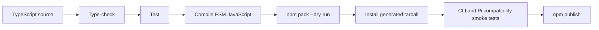
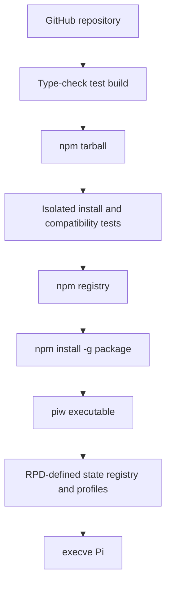

# PIW Release Policy

> Status: v1.0 release policy
>
> Product: `piw`
>
> Distribution: npm only
>
> Authority boundary: `RPD.md` defines product, state, CLI, TUI, discovery, validation, launch, and updater behavior. This document defines packaging, compatibility, versioning, and publication policy.

---

## 1. Release Philosophy

PIW is a TypeScript CLI/TUI distributed exclusively through npm. Users interact with one executable:

```bash
piw
```

TypeScript compilation, npm package layout, and internal libraries remain invisible during normal use.

Core release principle:

> **PIW should feel like a Unix executable while npm remains its only installation and self-update channel.**

PIW does not provide:

- a standalone binary archive;
- a Homebrew formula;
- a curl installer;
- a platform-specific installer; or
- an in-product self-updater.

---

## 2. Supported Runtime Baseline

PIW v1.0 officially supports:

| Component | Required baseline |
|---|---|
| Node.js | `>=22.19.0` |
| Pi | `>=0.83.0` |
| Operating system | macOS or Linux |
| Terminal | Modern ANSI terminal for interactive commands |

`package.json` MUST declare:

```json
{
  "engines": {
    "node": ">=22.19.0"
  }
}
```

The Node baseline is required because PIW's launch contract uses `process.execve()`, available from Node 22.15.0. PIW deliberately sets the slightly higher `22.19.0` floor to match its validated runtime baseline.

Windows and IBM i are not supported in v1.0 because Node does not expose `process.execve()` there. Other Unix-like platforms may work but do not receive platform-specific support until explicitly added to the compatibility matrix.

Ghostty is a primary development terminal, not a runtime dependency.

---

## 3. npm Package Identity

The unscoped npm package `piw` is controlled by another publisher, so the v1.0 package identity is `@scpz24/piw`. The package declares public scoped access in `publishConfig`; npm authentication and scope permission are still mandatory at publication time.

Publication requires verified permission for the `@scpz24` npm scope. If the publisher lacks that permission, publication is blocked until it is resolved. A releaser MUST NOT invent a different package name ad hoc.

The selected package name MUST expose the same executable:

```json
{
  "type": "module",
  "bin": {
    "piw": "./dist/cli.js"
  }
}
```

```bash
npm install -g @scpz24/piw
```

Installation MUST place `piw` on `PATH`.

---

## 4. Source and Build Output

PIW is implemented in TypeScript and published as ESM JavaScript.

A recommended responsibility-oriented source layout is:

```text
src/
├── cli/          # command parsing, exit codes, help
├── state/        # piw.json validation and atomic writes
├── registry/     # Entry discovery and classification
├── profiles/     # profile validation and resolution
├── launcher/     # Pi argv compilation and execve
├── updater/      # Entry-local Git/npm phase detection and execution
└── tui/          # selector and profile configuration
```

Compiled output is published below `dist/`. The executable entry point MUST begin with:

```js
#!/usr/bin/env node
```

and MUST retain executable permissions in the npm tarball.

Users MUST NOT need a TypeScript runtime or an additional post-install setup step.

---

## 5. Product Contract Dependency

The following product behaviors are defined exclusively in `RPD.md` and MUST NOT be independently re-specified here:

- the fixed registry and state paths;
- state schema and atomic-write semantics;
- Entry and profile naming;
- discovery and classification;
- selector and configuration behavior;
- CLI commands and exit codes;
- Pi argv compilation and resource isolation;
- Git/npm updater behavior; and
- error and security behavior.

Release work treats the approved RPD as an input contract. If implementation or packaging requires changing one of those behaviors, the RPD MUST be revised and approved first.

---

## 6. State Compatibility and Uninstallation

The npm package lifecycle MUST respect the state ownership contract in `RPD.md`.

Installation MAY create PIW-owned directories only when the executable first runs. npm install scripts MUST NOT initialize, migrate, or inspect user state.

Uninstalling PIW:

```bash
npm uninstall -g @scpz24/piw
```

MUST NOT delete PIW state or registered resources. Reinstalling or changing PIW versions must leave user data intact.

An installed release MUST:

- read schema versions it advertises support for;
- reject unsupported future schemas without rewriting them;
- perform any future migration before normal mutation;
- use atomic replacement for migrated state; and
- create a recoverable backup before any future destructive or structurally significant migration.

Migration backup files are not active canonical state. Application version `1.0.1` uses state schema version `1`; these version domains are independent. No migration from an earlier public schema is required.

---

## 7. Dependency Policy

PIW should remain lightweight.

Runtime dependencies SHOULD be:

- pure JavaScript or TypeScript;
- compatible with Node `>=22.19.0` on macOS and Linux;
- actively maintained;
- suitable for CLI/TUI use; and
- small in direct and transitive scope.

Native dependencies are prohibited for process replacement; PIW uses Node's built-in `process.execve()`.

PIW uses JSON state and therefore requires no database or native database binding.

External executables are checked only when relevant:

- `pi` is required for profile launch and launch compatibility checks;
- `pi` is required by `piw add` only when the requested package directory is absent;
- `git` is optional and required only for Git update phases; and
- `npm` is optional at Entry-update time and required only for npm update phases.

A missing optional updater executable disables only its related updates and is reported as specified by the RPD.

---

## 8. Subprocess and Shell Policy

All subprocesses MUST receive direct argument arrays. PIW MUST NOT interpolate user-controlled paths or package names through a shell.

Preferred form:

```ts
spawn("git", ["-C", root, "pull", "--ff-only"]);
spawn("npm", ["update", "--json"], { cwd: entryRealPath });
spawn(piPath, ["install", `npm:${packageName}`], { stdio: "inherit", shell: false });
```

Pi launch is not a child-process supervision flow. It uses `process.execve()` exactly as defined by `RPD.md`.

The installed executable MUST run as:

```bash
piw
```

It MUST NOT require invocation through `bash`, `zsh`, or another user-selected shell.

---

## 9. Versioning Policy

PIW follows Semantic Versioning:

```text
MAJOR.MINOR.PATCH
```

Starting with `1.0.0`:

- PATCH is a backward-compatible fix;
- MINOR is a backward-compatible feature; and
- MAJOR changes a public CLI, state, or behavior contract incompatibly.

A state schema change, public command removal, changed exit-code meaning, or incompatible profile behavior is a breaking contract change even if the TypeScript API is unchanged.

---

## 10. npm Distribution Tags

Stable releases use npm's default `latest` tag:

```bash
npm publish
```

Prereleases use SemVer prerelease identifiers and explicit non-stable tags:

```text
1.1.0-beta.1
1.1.0-rc.1
```

```bash
npm publish --tag beta
npm publish --tag next
```

The `latest` tag MUST NOT point to a prerelease version.

Users may install a specific or tagged version:

```bash
npm install -g @scpz24/piw@1.0.0
npm install -g @scpz24/piw@latest
npm install -g @scpz24/piw@beta
```

---

## 11. Updating PIW vs Updating Entries

PIW itself is updated through npm:

```bash
npm install -g @scpz24/piw@latest
```

PIW MUST NOT implement a self-updater in v1.0.

The commands have distinct responsibilities:

```text
npm install -g <package>@latest
    → update the PIW executable

piw update
    → run detected Entry-local Git/npm update phases
```

Release notes and CLI help MUST preserve this distinction.

---

## 12. Build and Publication Pipeline

A release candidate flows through:



The repository scripts MAY choose their exact names, but the pipeline MUST perform each stage. A conventional implementation is:

```bash
npm run typecheck
npm test
npm run build
npm pack --dry-run
npm publish
```

Publication MUST use the already-tested build output and package metadata. It MUST NOT rebuild from an uncommitted or different source state after verification.

---

## 13. Published Package Contents

The npm tarball should contain only runtime and user-facing release files, normally:

```text
dist/
package.json
README.md
LICENSE
CHANGELOG.md
```

Development-only content should be excluded:

```text
src/
tests/
.github/
coverage/
internal planning documents
```

`npm pack --dry-run` MUST verify:

- `dist/cli.js` is present and executable;
- package name and version are correct;
- the `piw` bin mapping targets an included file;
- required runtime assets are included;
- development secrets, caches, and test output are absent; and
- the package size is reasonable for a lightweight CLI.

---

## 14. Compatibility Verification

Each stable release MUST run launch-contract smoke tests against:

1. Pi `0.83.0`, the minimum supported version; and
2. the latest stable Pi version at release time.

The smoke test MUST confirm that Pi still supports:

- `--no-extensions`;
- `--no-skills`;
- `--no-prompt-templates`;
- `--no-themes`;
- `-e` / `--extension` for a local extension and package root;
- `--skill`;
- `--prompt-template`; and
- `--theme`.

It MUST also confirm that explicit resources remain available when their corresponding automatic discovery flags are disabled.

If the latest Pi release breaks the contract while `0.83.0` still works, publication is blocked until PIW's compatibility policy or implementation is deliberately revised. The releaser MUST NOT silently raise or remove version checks.

---

## 15. Tarball Installation Smoke Test

Before publication, install the exact generated tarball into an isolated test prefix and verify:

```text
piw --version
piw --help
piw list
piw doctor
piw add foo
piw <test-profile>
```

The smoke environment MUST use temporary PIW state or an isolated home directory and MUST NOT read or modify a developer's real `~/.pi/piw/`.

The smoke environment MUST provide an isolated fake `pi` executable that supports `pi --version`, `pi install npm:foo`, and captures launch/install arguments. The test MUST additionally confirm:

- the `piw` command is available on `PATH` without invoking a shell script manually;
- invalid JSON produces the RPD-defined error behavior;
- a future schema version is preserved and rejected;
- doctor accepts the fake compatible Pi without depending on the runner's global PATH;
- `piw add foo` installs only when absent, creates the exact absolute managed-store symlink, is idempotent, appears in discovery/doctor as an external package, and leaves `piw.json` byte-for-byte unchanged;
- a valid launch reaches `process.execve()` with deterministic arguments; and
- uninstalling the tarball leaves test state and Entry content intact.

---

## 16. Stable Release Checklist

Before publishing a stable release:

### Identity and metadata

- [ ] The unscoped/scoped package decision follows Section 3.
- [ ] The publisher has permission for the chosen npm package.
- [ ] `package.json` name, version, license, repository, and bin fields are correct.
- [ ] `engines.node` is `>=22.19.0`.
- [ ] Changelog and release notes are updated.
- [ ] Stable publication targets `latest`, not a prerelease tag.

### Build and package

- [ ] Type checking succeeds.
- [ ] Automated tests succeed.
- [ ] TypeScript compiles to ESM JavaScript.
- [ ] `dist/cli.js` has the Node shebang and executable permission.
- [ ] `npm pack --dry-run` contains only intended runtime files.
- [ ] The exact generated tarball installs successfully into an isolated prefix.

### Product-contract smoke tests

- [ ] `piw --help` and `piw --version` succeed.
- [ ] `piw list` and `piw doctor` satisfy their RPD exit-code contract.
- [ ] `piw add` accepts unscoped/scoped identities and rejects malformed arity, paths, sources, versions, and pass-through arguments.
- [ ] `piw add` smoke coverage verifies install-on-absence, symlink creation, discovery, external ownership, idempotency, and unchanged state.
- [ ] First-run initialization preserves pre-existing files.
- [ ] Invalid and future-version state files are never overwritten.
- [ ] Selector and configuration TUI start in supported terminals.
- [ ] Missing and incompatible Pi versions produce actionable errors.
- [ ] Profile validation and deterministic argv compilation work.
- [ ] Resource pass-through overrides are rejected.
- [ ] Git and npm updater safety cases match the RPD.
- [ ] Every top-level symlink Entry is external and cannot trigger target Git/npm mutation.

### Compatibility

- [ ] The launch contract passes against Pi `0.83.0`.
- [ ] The launch contract passes against the latest stable Pi.
- [ ] macOS smoke tests pass on a supported Node release.
- [ ] Linux smoke tests pass on a supported Node release.
- [ ] Uninstallation preserves PIW state and user-managed Entries.

---

## 17. Release Architecture



---

## 18. Release Invariants

1. PIW is distributed through npm only.
2. PIW is implemented in TypeScript and publishes compiled ESM JavaScript.
3. Every package identity exposes one executable named `piw`.
4. The minimum Node version is `22.19.0`.
5. The minimum Pi version is `0.83.0`.
6. Official v1.0 platforms are macOS and Linux.
7. PIW ships no standalone binary, Homebrew formula, or curl installer.
8. Product behavior and state semantics come from `RPD.md` and are not duplicated here.
9. PIW itself is updated through npm, never through `piw update`.
10. Package removal never removes PIW state or registered Entry content.
11. Runtime dependencies remain lightweight and do not provide native exec replacement.
12. Stable releases use `latest`; prereleases use explicit non-stable tags.
13. The exact tarball to be published is installed and smoke-tested first.
14. Every stable release tests the Pi launch contract at the minimum and latest supported versions.
